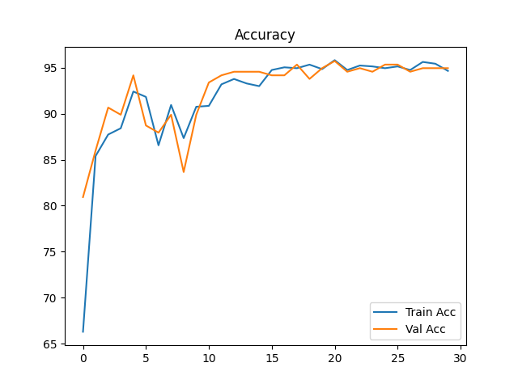
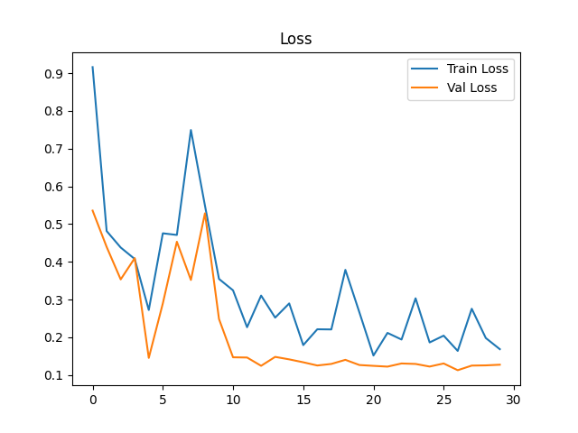
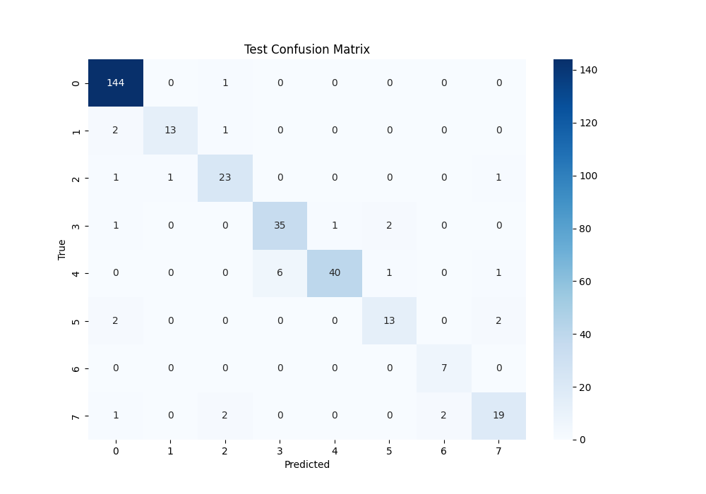

# ResNet50 Body Part Classifier

This project implements a deep learning pipeline using **ResNet50** to classify medical X-ray images into 8 body part categories.
It also includes feature space visualization (UMAP/t-SNE) and decision interpretability using **Grad-CAM**.


---

## Steps

- Classifies 8 body part categories using ResNet50
- Projects feature space using UMAP and t-SNE
- Visualizes model decision basis using Grad-CAM


---

## Installation

```bash
# (Optional) Create virtual environment
python -m venv .venv
source .venv/bin/activate  # on Windows use: .venv\Scripts\activate

# Install dependencies
pip install -r requirements.txt
```


---

## Data Availability
This project uses a public dataset available on [Kaggle](https://www.kaggle.com/competitions/unifesp-x-ray-body-part-classifier/data).
Due to storage limitations, the image data is **not included** in this repository.

To run the code, please download the dataset manually from the link above and place it in the following structure:
RESNET50-BODYPART/
├── data/
│   ├── raw/
│   │   ├── train/                 # Training images (.png)
│   │   └── test/                  # Testing images (.png)
│   ├── train_data.csv            # Metadata (image UID, labels)
│   └── test_data.csv
├── models/
│   └── model_epoch_30.pth        # Trained model weights
├── outputs/
│   ├── accuracy.png              # Accuracy curve
│   ├── loss.png                  # Loss curve
│   └── confusion_matrix_test.png # Confusion matrix on test set
├── src/
│   ├── bodypart_classifier.py    # Model training & evaluation
│   └── resnet_feature_visualization.py # UMAP / Grad-CAM visualization
├── LICENSE
├── README.md
└── requirements.txt

**Note**: This dataset is publicly available under the Kaggle license. Please review its usage terms before using it in other contexts.


---

## Usage

```bash
### 1. Train the model
python src/bodypart_classifier.

### 2. Visualize feature space & Grad-CAM
# Make sure the model checkpoint "MODEL_PATH" exists in the models/ directory.
python src/resnet_feature_visualization.py
```


---

## Requirements

- Python 3.8+
- PyTorch ≥ 1.12
- torchvision
- scikit-learn
- matplotlib
- seaborn
- umap-learn
- tqdm
- torchinfo


---

## Results

### Accuracy & Loss



### Confusion Matrix



---

## 📄 License

This project is licensed under the [MIT License](LICENSE).